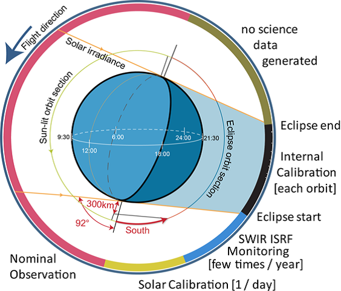
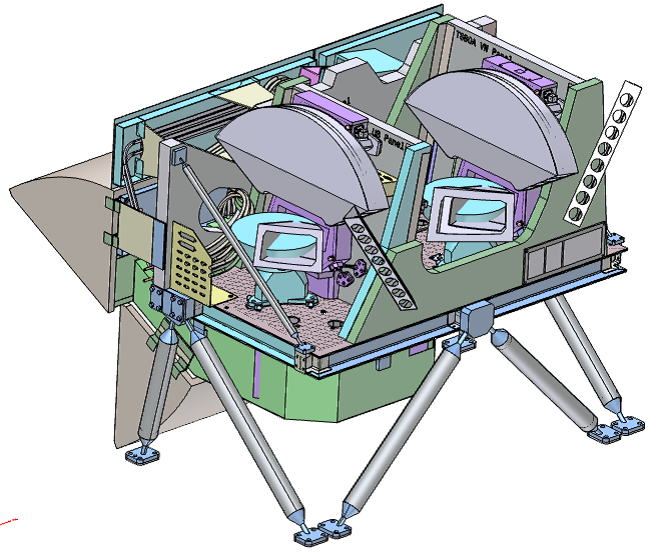
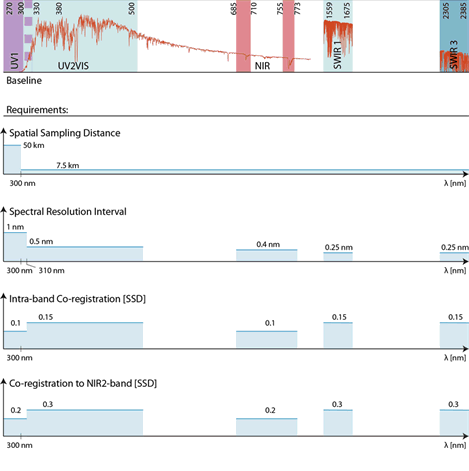
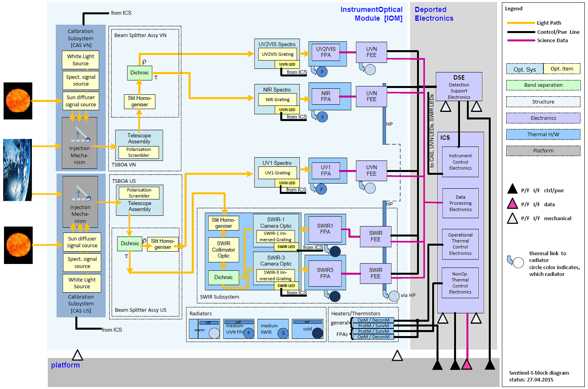

```{r setup, include=FALSE}
options(htmltools.dir.version = FALSE)
knitr::opts_chunk$set(
  fig.width=9, fig.height=3.5, fig.retina=3,
  out.width = "100%",
  cache = FALSE,
  echo = TRUE,
  message = FALSE, 
  warning = FALSE,
  hiline = TRUE
)
```

```{r xaringan-themer, include=FALSE, warning=FALSE}
library(xaringanthemer)
style_duo_accent(
  primary_color = "#1381B0",
  secondary_color = "#FF961C",
  inverse_header_color = "#FFFFFF"
)
```

### Introduction of Sentinel-5p
.pull-left[
  The **Sentinel-5P satellite**, part of the European Space Agency's (ESA) Copernicus program, is characterized by the following features: 
1. **Air Quality Monitoring**: Equipped with advanced instruments like TROPOMI (TROPOspheric Monitoring Instrument).

2. **High resolution and wide coverage**: Sentinel-5P is capable of global coverage with a spatial resolution of 7 x 3.5 kilometres.

3. **Data transmission and processing**: Sentinel-5P uses a high-speed data link for fast data transmission.
]

.pull-right[
```{r  echo=FALSE, out.width='110%', fig.align='center'}

```
Intrument Operations Scenario,
Source: https://sentinels.copernicus.eu/web/sentinel/home
]
---
### Sentinel-5p Major Job
.pull-left[
**Atmospheric monitoring**: Detects data on a wide range of trace gases (nitrogen dioxide, carbon monoxide, sulphur dioxide, formaldehyde, etc.).
]
.pull-right[
**Climate monitoring**: The Tropomi Multi-spectral Imaging Spectrometer does measure/quantify other greenhouse gases such as methane.
]


```{r  echo=FALSE, out.width='65%', fig.align='center'}
knitr::include_graphics('Figure/Week 2/Global_tropospheric_ozone_article.gif')
```
GlobalTropospheric_Ozone_Article,
Source: https://sentinels.copernicus.eu/web/sentinel/home


---
### Satellite Specifications - Physical Parameters
.pull-left[
1. **Size**: The Sentinel-5P satellite is relatively compact, with its main body measuring approximately 2.4 metres x 0.9 metres x 0.9 metres.

2. **Weigh**t: The total weight of the satellite is approximately 820kg. This includes all its scientific instruments, communication equipment, solar panels and other necessary satellite components.

3. **Orbital altitude**: Sentinel-5P operates in a sun-synchronous orbit of approximately 824 kilometres. Observing any part of the Earth at close to the same time every day.
]
.pull-right[
```{r  echo=FALSE, out.width='100%', fig.align='center'}

```
Mission_Instrument of Sentinel-5P,
Source: https://sentinels.copernicus.eu/web/sentinel/home
]

---
###Satellite Specifications - Major Instruments: TROPOMI
### What Is TROPOMI - 1
Full Name - **Tropospheric Monitoring Instrument**

***It is an instrument for atmospheric compositional observation on board the S5P satellite, which can effectively observe trace gas components in the atmosphere around the globe.***

#### Functionality:
- Core instrument, advanced spectral imaging device.
- Monitors atmospheric ozone, methane, formaldehyde, nitrogen dioxide, sulfur dioxide, and other gases.
- Provides high spatial resolution data on atmospheric pollutants.
- Aids scientists in monitoring and researching air pollution and climate change.

---
### What Is TROPOMI - 2
.pull-left[
#### Technical Specifications:
- Utilizes ultraviolet, visible, near-infrared, and short-wave infrared spectral bands.
- Precisely detects and quantifies a variety of chemical substances in the Earth's atmosphere.
- Spatial resolution of 7 x 7 km, suitable for city-level air quality monitoring.

#### Applications:
- Data used for global climate change research, air quality monitoring, and ozone layer protection.
- Provides crucial tools for scientists, policymakers, and environmental regulatory agencies.
- Key resource for understanding and addressing environmental challenges.
]

.pull-right[
```{r  echo=FALSE, out.width='90%', fig.align='center'}

```
Spectral bands,
Source: https://sentinels.copernicus.eu/web/sentinel/home
]

---
### Compare With Other Satellites
| Feature/Satellite | Sentinel-5P                            | Sentinel-2                         | Sentinel-3                             |
|-------------------|----------------------------------------|------------------------------------|----------------------------------------|
| **Primary Use**   | Monitoring atmospheric pollution and climate change | Earth surface monitoring, including vegetation, land, and water | Ocean and land environment monitoring   |
| **Sensor Type**   | TROPOMI (Tropospheric Monitoring Instrument) | Multispectral instruments, high resolution | Multispectral imagers, ocean and land color instruments |
| **Monitoring Content** | Greenhouse gases, atmospheric pollutants  | Land cover changes, vegetation health | Ocean color temperature, land surface temperature, water color |
| **Data Applications** | Climate change research, air quality monitoring | Agriculture, forestry management, urban planning | Oceanography, hydrology, climate monitoring |
| **Synergy**       | Complements Sentinel-2/3's ground and ocean observations with atmospheric data | Combined with Sentinel-5P's atmospheric data, can be used to assess environmental change impact on land | Combined with Sentinel-5P's atmospheric data, helps understand the interactions between ocean processes and climate change |


---
### Additional Feature - Calibration Subsystem
.pull-left[
- **Calibration Subsystem (CAS)**: Each telescope of the Sentinel-5 instrument is equipped with a CAS for in-orbit calibration.
- **Function**: Injects different calibration signals.
- **Methods of Calibration**:
  - **Internal Calibration Source**: Uses a drive-injection mirror.
  - **Solar Calibration Measurements**: Employs a diffusion element.
- **Location**: Positioned before the first optical component of the telescope.
- **Purpose**: Facilitates calibration of the instrument's entire optical path.
]
.pull-right[
```{r  echo=FALSE, out.width='130%', fig.align='center'}

```
Instrument Architecture,
Source: https://sentinels.copernicus.eu/web/sentinel/home
]


---
### Simple Video of Sentinel-5p Intro Made By ESA
<iframe width="840" height="473" src="https://www.youtube.com/embed/doqsNc8vC00" frameborder="0" allow="accelerometer; autoplay; encrypted-media; gyroscope; picture-in-picture" allowfullscreen style="display: block; margin: auto;"></iframe>

---

### Future Application & Advantages
#### Overview

- **Highly Advanced**: Best atmospheric monitoring tool so far.
- **Wide Area Coverage**: 2600 km wide area.
- **Rapid, Detailed Data**Quick, detailed data on pollutants.
- **Advances in Environmental Monitoring**: Opens new possibilities for space-based environmental monitoring.
- **Improvement Over Previous Instruments**: Enhanced detail and clarity compared to older space tools.

#### Key Advantages

- **Combines Strengths of Previous Instruments**: Integrates best features from predecessors for superior performance.
- **Enhanced Resolution and Clarity**: Able to detect smaller pollution sources with greater clarity, especially in cloud-free areas.
- **Meeting Sentinel-5's Ambitious Goals**: Successfully achieves the challenging objectives of the Sentinel-5 project.

---
### Reference
Introducing Sentinel-5P, 2017. [https://www.youtube.com/watch?v=doqsNc8vC00](https://www.youtube.com/watch?v=doqsNc8vC00).

KNMI. ‘TROPOMI Observing Our Future - TROPOMI: TROPOspheric Monitoring Instrument’. Web page. Ministry of Infrastructure and Water Management, 17 April 2023. [https://www.tropomi.eu/](https://www.tropomi.eu/).

Sentinel Online. ‘Sentinel-5P - Missions - Sentinel Online’. Accessed 19 January 2024. [https://copernicus.eu/missions/sentinel-5p](https://copernicus.eu/missions/sentinel-5p).

‘Sentinel-5P’. Accessed 19 January 2024. [https://www.esa.int/Applications/Observing_the_Earth/Copernicus/Sentinel-5P](https://www.esa.int/Applications/Observing_the_Earth/Copernicus/Sentinel-5P).
